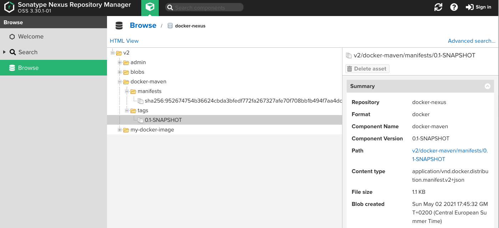

# Docker Maven Spotify Plugin

This project demonstrated the basic functionality of the Spotify Dockerfile plugin. The maven settings.xml needs the credentials of the target docker repository. 

## Maven Deploy

Maven deploys the docker image is build and pushed to the repository.

```
mvn clean deploy

...

--- dockerfile-maven-plugin:1.4.13:push (default) @ docker ---
[INFO] The push refers to repository [localhost:8082/docker-maven]
[INFO] Image 3648d0ef3f8f: Preparing
[INFO] Image 4cb12f8480a2: Preparing
[INFO] Image 01fd0cc52258: Preparing
[INFO] Image 32f366d666a5: Preparing
[INFO] Image 01fd0cc52258: Layer already exists
[INFO] Image 32f366d666a5: Layer already exists
[INFO] Image 4cb12f8480a2: Layer already exists
[INFO] Image 3648d0ef3f8f: Layer already exists
[INFO] 0.1-SNAPSHOT: digest: sha256:952674754b36624cbda3bfedf772fa267327afe70f708bb1b494f7aa4dcdb954 size: 1160
[INFO] Image null: null
[INFO] ------------------------------------------------------------------------
[INFO] BUILD SUCCESS
[INFO] ------------------------------------------------------------------------
[INFO] Total time:  7.526 s
[INFO] Finished at: 2021-05-02T17:45:32+02:00
```

The following figure shows the uploaded Docker image in the Nexus Repository.



## Dockerfile Build

The dockerfile:build command creates the docker image on the maven installation server. Please take in mind that the solution builds the docker images in the target folder.

```
mvn dockerfile:build

 -------------------------< org.example:docker >-------------------------
[INFO] Building docker 1.0-SNAPSHOT
[INFO] --------------------------------[ jar ]---------------------------------
[INFO] 
[INFO] --- dockerfile-maven-plugin:1.4.13:build (default-cli) @ docker ---
[INFO] dockerfile: null
[INFO] contextDirectory: /Users/stefanzils/Documents/GitHub/microservices-examples/docker-maven/target/docker
[INFO] Building Docker context /Users/stefanzils/Documents/GitHub/microservices-examples/docker-maven/target/docker
[INFO] Path(dockerfile): null
[INFO] Path(contextDirectory): /Users/stefanzils/Documents/GitHub/microservices-examples/docker-maven/target/docker
[INFO] 
[INFO] Image will be built as localhost:8082/docker-maven:0.1-SNAPSHOT
[INFO] 
[INFO] Step 1/6 : FROM adoptopenjdk/openjdk11:alpine
[INFO] 
[INFO] Pulling from adoptopenjdk/openjdk11
[INFO] Digest: sha256:fac0c8196649684ca249b2bf197fc41208bf0ffaae83b35f1f5ed11c72687747
[INFO] Status: Image is up to date for adoptopenjdk/openjdk11:alpine
[INFO]  ---> 76a174e621f9
[INFO] Step 2/6 : RUN addgroup -S spring && adduser -S spring -G spring
[INFO] 
[INFO]  ---> Using cache
[INFO]  ---> cafa2be07f8f
[INFO] Step 3/6 : USER spring:spring
[INFO] 
[INFO]  ---> Using cache
[INFO]  ---> 65a32032c320
[INFO] Step 4/6 : VOLUME /tmp
[INFO] 
[INFO]  ---> Using cache
[INFO]  ---> 3a2052e51632
[INFO] Step 5/6 : ARG JAR_FILE
[INFO] 
[INFO]  ---> Using cache
[INFO]  ---> 958a4c4e347b
[INFO] Step 6/6 : EXPOSE 8080
[INFO] 
[INFO]  ---> Using cache
[INFO]  ---> 06378df6faca
[INFO] Successfully built 06378df6faca
[INFO] Successfully tagged localhost:8082/docker-maven:0.1-SNAPSHOT
[INFO] 
[INFO] Detected build of image with id 06378df6faca
[INFO] Successfully built localhost:8082/docker-maven:0.1-SNAPSHOT
[INFO] ------------------------------------------------------------------------
[INFO] BUILD SUCCESS
[INFO] ------------------------------------------------------------------------
[INFO] Total time:  5.057 s
[INFO] Finished at: 2021-05-02T18:00:57+02:00
[INFO] ------------------------------------------------------------------------
```
## Dockerfile Push

The dockerfile:push command makes an upload of the local to docker image to the repository. Please take in mind that the solution builds the docker images in the target folder.

```
mvn dockerfile:push

 -------------------------< org.example:docker >-------------------------
[INFO] Building docker 1.0-SNAPSHOT
[INFO] --------------------------------[ jar ]---------------------------------
[INFO] 
[INFO] --- dockerfile-maven-plugin:1.4.13:push (default-cli) @ docker ---
[INFO] The push refers to repository [localhost:8082/docker-maven]
[INFO] Image 3648d0ef3f8f: Preparing
[INFO] Image 4cb12f8480a2: Preparing
[INFO] Image 01fd0cc52258: Preparing
[INFO] Image 32f366d666a5: Preparing
[INFO] Image 01fd0cc52258: Layer already exists
[INFO] Image 4cb12f8480a2: Layer already exists
[INFO] Image 32f366d666a5: Layer already exists
[INFO] Image 3648d0ef3f8f: Layer already exists
[INFO] 0.1-SNAPSHOT: digest: sha256:952674754b36624cbda3bfedf772fa267327afe70f708bb1b494f7aa4dcdb954 size: 1160
[INFO] Image null: null
[INFO] ------------------------------------------------------------------------
[INFO] BUILD SUCCESS
[INFO] ------------------------------------------------------------------------
[INFO] Total time:  2.306 s
[INFO] Finished at: 2021-05-02T18:02:00+02:00
[INFO] ------------------------------------------------------------------------

```

## Other Plugins

This section contains a list of other Docker Maven Plugin implementations.
- fabric8io/docker-maven-plugin https://dmp.fabric8.io
- Google Jib https://github.com/GoogleContainerTools/jib
