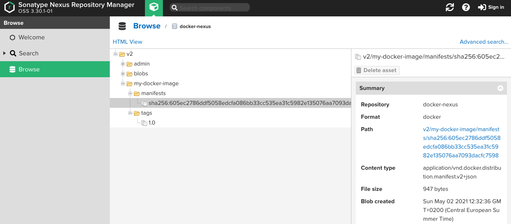

# Build and Push Images

This section describes the steps to push a local docker image to an Artifact Repository. This example uses the Nexus Repository. For an easy solution, the section Docker Local Registry describes a registry that runs in a container. The easy solution does not need authentication. The [docker documentation](https://docs.docker.com/engine/reference/commandline/push/) gives more context about pushing the image.

## Docker Local Registry

Run a local register to have a private instance for your images ([Deploy a registry server](https://docs.docker.com/registry/deploying/)).
It is an option for an Artifact Respostority like Nexus.

``` 
docker run -d -p 5000:5000 --restart=always --name registry registry:2
```

## Build Docker Image

``` 
docker build -t my-docker-image .
```

## Tag Docker Image

After building the image, it has to be tagged (labeled) to the repository server.

``` 
docker tag my-docker-image:1.0 localhost:8082/my-docker-image:1.0
```

The command docker images show the images in the local docker installation.

```
docker images
REPOSITORY                       TAG            IMAGE ID       CREATED         SIZE
my-docker-image                  1.0            7e7f0ea2f669   24 months ago   105MB
localhost:8082/my-docker-image   1.0            7e7f0ea2f669   24 months ago   105MB
```

## Login to Repository

In this step, it is necessary to check if authentication to the repository is needed. 

```
docker login localhost:8082
```

## Push the Image to the Repository

The Push command uploads the docker image to the Artifact Repository.

```
docker image push localhost:8082/my-docker-image:1.0
The push refers to repository [localhost:8082/my-docker-image]
ceaf9e1ebef5: Layer already exists 
9b9b7f3d56a0: Layer already exists 
f1b5933fe4b5: Layer already exists 
1.0: digest: sha256:605ec2786ddf5058edcfa086bb33cc535ea31c5982e135076aa7093dacfc7598 size: 947
```

The following figures show the artifact in the Nexus Repository.



## Images with same ID

The following command shows all tags for the same image. It is helpful to find all tags for a particular image.

```
docker images --no-trunc | grep $(docker inspect -f {{.ID}} localhost:8082/docker-test:1.0)

localhost:8082/docker-maven      0.1-SNAPSHOT   sha256:06378df6faca252c4a15a93b2399f88cbbf48949c7481b873a11b464d1e7733a   About an hour ago   341MB
localhost:8082/docker-test       0.1-SNAPSHOT   sha256:06378df6faca252c4a15a93b2399f88cbbf48949c7481b873a11b464d1e7733a   About an hour ago   341MB
localhost:8082/docker-test       1.0            sha256:06378df6faca252c4a15a93b2399f88cbbf48949c7481b873a11b464d1e7733a   About an hour ago   341MB
```

## Docker History

Docker history shows each layer of a docker image.

``` 
docker history 7e7f0ea2f669
IMAGE          CREATED         CREATED BY                                      SIZE      COMMENT
7e7f0ea2f669   24 months ago   CMD ["/bin/sh" "-c" "java ${JAVA_OPTS}"]        0B        buildkit.dockerfile.v0
<missing>      24 months ago   ENV JAVA_OPTS=-jar java_lib/app.jar             0B        buildkit.dockerfile.v0
<missing>      24 months ago   ENV JAVA_LIB_DIR=java_lib                       0B        buildkit.dockerfile.v0
<missing>      24 months ago   ENV JAVA_INITIAL_MEMORY=256M                    0B        buildkit.dockerfile.v0
<missing>      24 months ago   ENV JAVA_MAX_MEMORY=256M                        0B        buildkit.dockerfile.v0
<missing>      24 months ago   /bin/sh -c set -x  && apk add --no-cache   o…   99.3MB    
<missing>      24 months ago   /bin/sh -c #(nop)  ENV JAVA_ALPINE_VERSION=8…   0B        
<missing>      24 months ago   /bin/sh -c #(nop)  ENV JAVA_VERSION=8u212       0B        
<missing>      24 months ago   /bin/sh -c #(nop)  ENV PATH=/usr/local/sbin:…   0B        
<missing>      24 months ago   /bin/sh -c #(nop)  ENV JAVA_HOME=/usr/lib/jv…   0B        
<missing>      24 months ago   /bin/sh -c {   echo '#!/bin/sh';   echo 'set…   87B       
<missing>      24 months ago   /bin/sh -c #(nop)  ENV LANG=C.UTF-8             0B        
<missing>      24 months ago   /bin/sh -c #(nop)  CMD ["/bin/sh"]              0B        
<missing>      24 months ago   /bin/sh -c #(nop) ADD file:a86aea1f3a7d68f6a…   5.53MB

``` 
