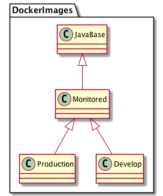

# PlantUML Microservice Diagrams

This repository contains some basic UML Diagrams for presentations and microservices examples. The diagrams are generated with [PlantUML](https://plantuml.com/en/).

## J2EE Webshop Monolith

## Microservices Webshop

### Business Process Engine

### Compose Microservice / HATEOS

## Application Gateway

## Build Process

## CI/CD System

## GitLab CI/CD

## DockerImages

